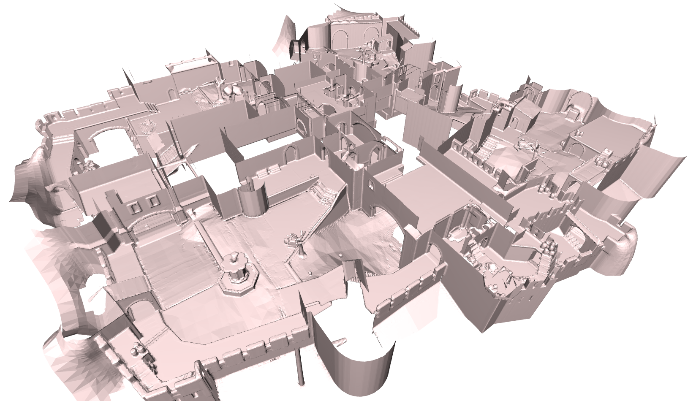

# CornerCullingSourceEngine

### Introduction
This is the latest in a long line of occlusion culling / anti-wallhack systems.  
There are a few features that make this implementation great for competitive Counter-Strike:
- Open source
- Good performance (1-2% of frame time for 10 v 10 128-tick Dust2)
- Strict culling with ray casts
- Guaranteed to be optimistic (no popping) for players under the latency threshold set in culling.cfg

The main caveat is that occluders are placed manually, so we do not automatically support community maps.  
I suspect that there are still a few placement errors, which cause players to be invisible, so please submit an issue with a video.  
All feedback is welcome!

### Installation
- Install SourceMod  
- Drag the contents of "InstallThis" into csgo-ds/csgo  

### Adding Occluders to Custom Maps
- Note: This process can be quite laborious. If you have many complex custom maps, I reccomend using a different anti-wallhack.
- Create a file for your custum map, csgo/maps/culling_<MAPNAME>.txt
  - To prevent crashes, you may need a placeholder occluder (AABB from 0 0 0 to 1 1 1) until you add more
- Compile and install culling_editor.sp
  - To prevent your CS:GO client from crashing, you may have to unload culling_editor until after your client joins
  - The editor attemps to display the top-most occluder, although it may miss edges if vertices are inside the map
  - Print the coordinates of a point to console by looking at it and attacking. You must be client #1
- An axis-aligned bounding box is declared by "AABB" and defined by the coordinates of two opposite vertices
- A cuboid is declared by "cuboid" and defined by
  - offset
  - scale
  - rotation
  - 8 vertices in the order below
- A cuboid is usually best defined with 8 raw vertex coordinates, "0 0 0" offset, "1 1 1" scale, and "0 0 0" rotation
- The user must ensure that the vertices of a cuboid's faces are coplanar. Failure will cause undefined behavior
- You can loosely check your work with "r_drawothermodels 2"; however, it is not as rigorous as testing with a real wallhack

```  
   .1------0
 .' |    .'|
2---+--3'  |
|   |  |   |
|  .5--+---4
|.'    | .'
6------7'
```

### Issue Log
- Mirage sandwich (Probably fixed 10/24/20)

### Experimental
- Automatic mesh generation for an alternative occlusion culling algorithm
- While the mesh generation is mostly fine, save for a few transparency issues, the necessary triangle intersection and other integration code will take a fair bit of work.
- Also, you may wonder why I made the seemingly insane decision to use the Source ray tracing system to generate my own mesh to feed into my own ray tracing system. The reason is that one needs to "relax" the mesh to guarantee correctness. Consider peeking through a 1-pixel gap in mid doors. A ray trace against the in-game mesh cannot check every pixel every frame. You have to relax the mesh by pushing every vertex inward--by a distance determined by the resolution of the player bounding mesh that you trace against.
- However, in a non-tournament setting, this edge case shouldn't matter. I don't think it even matters for a platform like FACEIT. Also, there are a few community anti-wallhacks that operate with the Source ray tracing system, but the ones I'm aware of cost money. I hope I will eventually find a few weeks to finish my mesh system or fix SMAC. 


### Future Work
- Polish lookahead logic  
- Find and fill "missed spots" in maps  
- Calculate lookahead with velocity instead of speed  
- Update automatically (perhaps https://forums.alliedmods.net/showthread.php?t=169095)  
- Join occluders, preventing "leaks" through thin corners  
- Anti-anti-flash  
- Smoke occlusion  

### Technical details
- You can find more details with the original UE4 implementation:
https://github.com/87andrewh/CornerCulling

### Special Thanks
Paul "arkem" Chamberlain  
Garrett Weinzierl at PlayWin  
DJPlaya, lekobyroxa, and the AlliedModders community  
Challengermode esports platform  
TURF! community servers  
